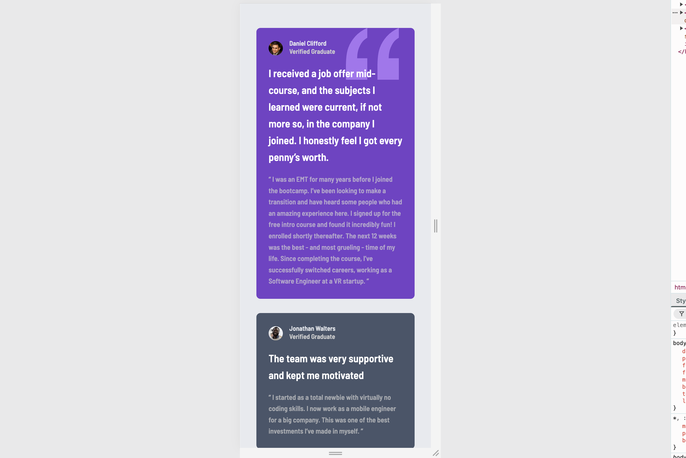

# Frontend Mentor - Testimonials grid section solution

This is a solution to the [Testimonials grid section challenge on Frontend Mentor](https://www.frontendmentor.io/challenges/testimonials-grid-section-Nnw6J7Un7). Frontend Mentor challenges help you improve your coding skills by building realistic projects.

## Table of contents

- [Overview](#overview)
  - [The challenge](#the-challenge)
  - [Screenshot](#screenshot)
  - [Links](#links)
- [My process](#my-process)
  - [Built with](#built-with)
  - [What I learned](#what-i-learned)
- [Author](#author)

## Overview

### The challenge

Users should be able to:

- View the optimal layout for the site depending on their device's screen size

  
  
  

### Links

- Solution URL: [https://github.com/Tainicknackz/testimonials-grid-section](https://github.com/Tainicknackz/testimonials-grid-section)
- Live Site URL: [magenta-begonia-1a1f01](https://magenta-begonia-1a1f01.netlify.app/)

## My process

### Built with

- Semantic HTML5 markup
- CSS custom properties
- CSS FLEX-BOX
- CSS GRID
- Mobile-first workflow

### What I learned

_CSS Flex-box_, _grid-template-columns_, _grid-template-rows_, _grid-template-areas_, _align-self_ property in _CSS Grid_, and _Media Queries_ were clear to me. How to keep columns and rows responsive and scalable. **As shown below:-**

```HTML
<main class="box__ctn box__wrapper">
    <article class="box__article-dan">
    </article>
    <article class="box__article-jon">
    </article>
    <article class="box__article-jean">
    </article>
    <article class="box__article-pat">
    </article>
    <article class="box__article-kira">
    </article>
</main>
```

```css
@media (min-width: 35rem) {
  .box__ctn {
    display: grid;
    grid-template-columns: 1fr 1fr;
  }

  .box__article-dan {
    grid-column: 1 / 3;
  }

  .box__article-jon {
    grid-column: 1 / 2;
  }

  .box__article-jean {
    grid-column: 2 / 3;
  }

  .box__article-pat {
    grid-column: 1 / 2;
  }

  .box__article-kira {
    grid-column: 2 / 3;
  }
}

@media (min-width: 55rem) {
  .box__ctn {
    display: grid;
    grid-template-columns: repeat(4, 1fr);
  }

  .box__article-dan {
    grid-column: 1 / 3;
    grid-row: 1 / 2;
  }

  .box__article-jon {
    grid-column: 3 / 4;
    grid-row: 1 / 2;
  }

  .box__article-jean {
    grid-column: 1 / 2;
    grid-row: 2 / 3;
  }

  .box__article-pat {
    grid-column: 2 / 4;
    grid-row: 2 / 3;
  }

  .box__article-kira {
    grid-column: 4 / 5;
    grid-row: 1 / 3;
  }
}
```

- Frontend Mentor - [@Tainicknackz](https://www.frontendmentor.io/profile/Tainicknackz)
- GitHub - [@Tainicknackz](https://www.github.com/Tainicknackz)
